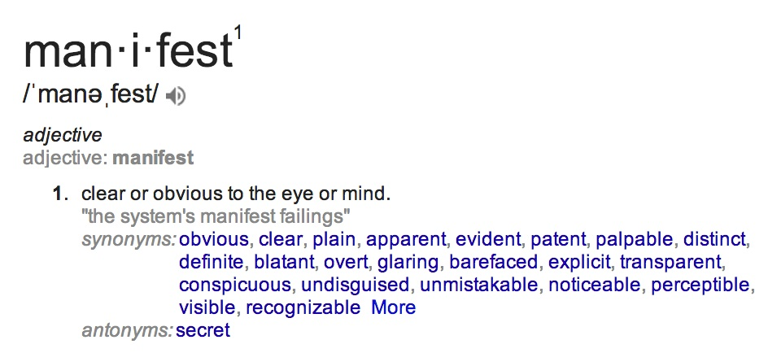

Android-ManifestDestiny
=======================



The Android Manifest is the lifeblood of any Android Application.  It tells the Android System (AKA your device) all of the vital information necessary for interacting with your application.  Take some time and read the documentation for the Android Manifest linked in the resources section.  A number of the items in the manifest will be necessary for Advanced functionality that we'll cover later in the course, so for now let's disect a fairly barebones Android Manifest.  

```xml 
<?xml version="1.0" encoding="utf-8"?>
<manifest xmlns:android="http://schemas.android.com/apk/res/android"
    package="com.flatironschool.aboutme" >

    <application
        android:allowBackup="true"
        android:icon="@drawable/ic_launcher"
        android:label="@string/app_name"
        android:theme="@style/AppTheme" >
        <activity
            android:name=".Controller.ProfileActivity"
            android:label="@string/app_name" >
            <intent-filter>
                <action android:name="android.intent.action.MAIN" />
                <category android:name="android.intent.category.LAUNCHER" />
            </intent-filter>
        </activity>
    </application>

</manifest>

```

Manifest and Application are the only two required XML elements.  Let's have a look at the fantastic Android documentation which guides us through the required and optional elements of Manifest and Application.  

### Manifest Element 

[Manifest Element](http://developer.android.com/guide/topics/manifest/manifest-element.html)

```xml 

CONTAINED IN:
none
MUST CONTAIN:
<application>
CAN CONTAIN:
<compatible-screens> 
<instrumentation> 
<permission> 
<permission-group> 
<permission-tree> 
<supports-gl-texture> 
<supports-screens> 
<uses-configuration> 
<uses-feature> 
<uses-permission> 
<uses-sdk>

```
Esentially the Docs are telling us that the Manifest application must contain an inner element `application` and can contain a host of other elements.  Great so let's create the necessary XML to satisfy that requirement.   

```xml 
<manifest>

    <application> 
    </application>

</manifest>

```

Awesome! But we're not quite done with the manifest element yet.  The docs also say this about the manifest element:  

"It must contain an <application> element and specify xmlns:android and package attributes."

So let's add in the xmlns:android and package attributes

```xml 
<manifest xmlns:android="http://schemas.android.com/apk/res/android"
			    package="com.flatironschool.aboutme">

    <application> 
    </application>

</manifest>

```

xmlns:android is boilerplate that always points to "http://schemas.android.com/apk/res/android" and defines the Android namespace.  The Package name serves as a unique identifier for your application and should be defined using reverse DNS notation as we have above.  

That's all for our barebones manifest element.  Let's move on to beefing up our application element.  

Technically, the application element requires nothing, but more practically there are a few elements and attributes that will always be there.  Let's update our Manifest with a typical application element.  

```xml 
<manifest xmlns:android="http://schemas.android.com/apk/res/android"
			    package="com.flatironschool.aboutme">

    <application 

        android:allowBackup="true"
        android:icon="@drawable/ic_launcher"
        android:label="@string/app_name"
        android:theme="@style/AppTheme"> 

        <activity>
        	<!--  We'll explain the activity element next!  -->
        </activity>

    </application>

</manifest>

```

The application element's attributes define some important customizations for your app.  Here we've defined that our app allows backup, has an icon, a user readable label, and a theme. 

The last piece we'll add to the application element is an activity element.  

```xml 
<?xml version="1.0" encoding="utf-8"?>
<manifest xmlns:android="http://schemas.android.com/apk/res/android"
			    package="com.flatironschool.aboutme">

    <application 
        android:allowBackup="true"
        android:icon="@drawable/ic_launcher"
        android:label="@string/app_name"
        android:theme="@style/AppTheme"> 

        <activity  
            android:name=".Controller.ProfileActivity"
            android:label="@string/app_name">

        	<intent-filter>
        	 <action android:name="android.intent.action.MAIN" />
             <category android:name="android.intent.category.LAUNCHER" />
        	</intent-filter> 
        </activity>

    </application>

</manifest>

```

All activities (User Interface Elements) must be defined in the Android manifest.  In this case, we define a single activity with an intent filter that specifies that this particular activity is the application launch activity.  We'll go into intent filters in more details later in the course.  

We also added a little line `<?xml version="1.0" encoding="utf-8"?>` to define the xml version of our manifest and that's all.  

Phew! You made it.  Now to the lab. 

##Instructions  

  1.  Make a new project Located in the same directory as this README
  
  2.  Change your projects default theme to `android:Theme.Translucent` "using" the projects Manifest.  Note: the quotes are there because you won't actually change any XML code directly in the manifest file.  **Hint** Hover over the android:theme value in the manifest XML, press command+b, and Android studio will open the source file that defines the defined style.  
  
  3.  Add a new Activity to your project called ManifestDestinyActivity.java.  Make sure to create your activity by using the new -> Java Class template and not the Activity Template.   
  
  4.  In your Manifest, add an Activity element for your new Activity.  Make sure that the activity is configured to be the main launch Activity for your application.  You should read the entire documentation for [Intents and Filters](http://developer.android.com/guide/components/intents-filters.html), but for now this snippet is a great example of how to designate an Activity as the Main launch activity for your app.  
  
  ```xml
    <activity android:name="MainActivity">
    <!-- This activity is the main entry, should appear in app launcher -->
        <intent-filter>
            <action android:name="android.intent.action.MAIN" />
            <category android:name="android.intent.category.LAUNCHER" />
        </intent-filter>
    </activity>
  ```
  5. Our App is nearly ready to launch.  The last step is to add some code to our `ManifestDestinyActivty` that will inflate our User Interface XML.   
  
  ``java

  package com.flatironschool.manifestdestiny;

import android.app.Activity;
import android.os.Bundle;


public class ManifestDestinyActivity extends Activity {


    @Override
    protected void onCreate(Bundle savedInstanceState) {
        super.onCreate(savedInstanceState);

        setContentView(R.layout.activity_manifestdestiny);

    }
}

  ```

##Resources 

- [Android Developer Docs](http://developer.android.com/guide/topics/manifest/manifest-intro.html)
- [Intents and Intent Filters](http://developer.android.com/guide/components/intents-filters.html)